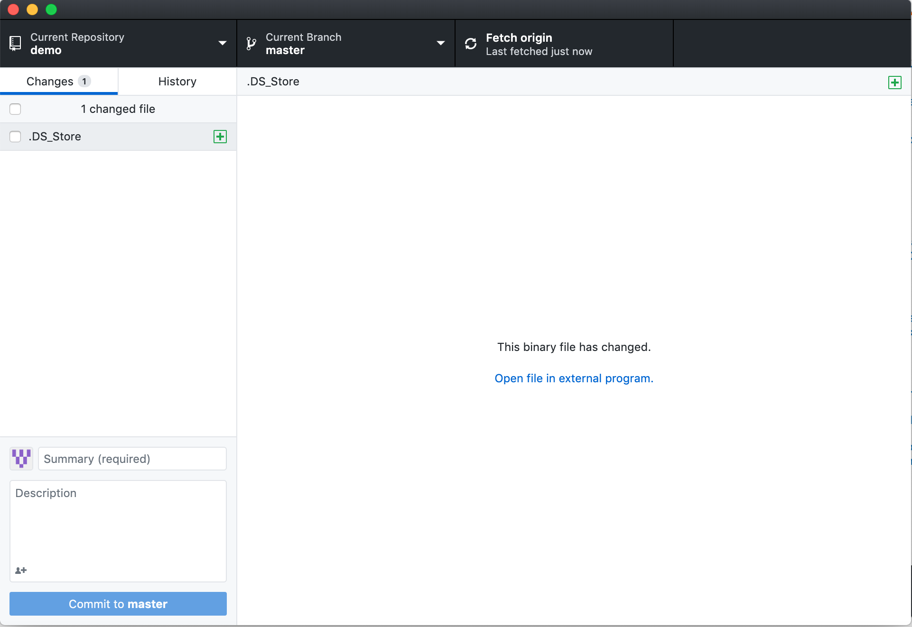
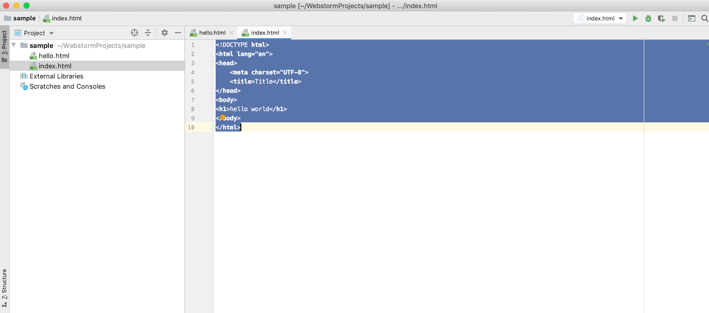
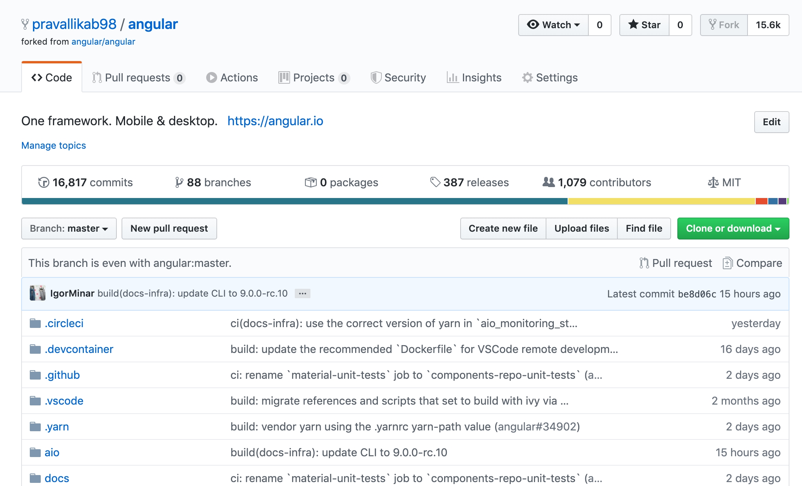

# web-programming-spring-2020
created web icp1 repository.

created 2 directories source and destination.

added index.html to source and added some screenshots to documentation folder.

taken screenshot of repository creation and placed in documentation folder

installed webstorm and placed screenshot in documentation folder

forked existing repository

created new branch and made a pull request

created an issue and described pull request in that
